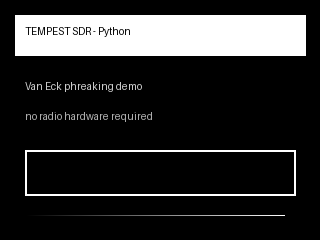
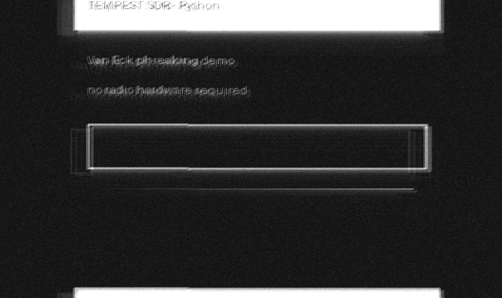
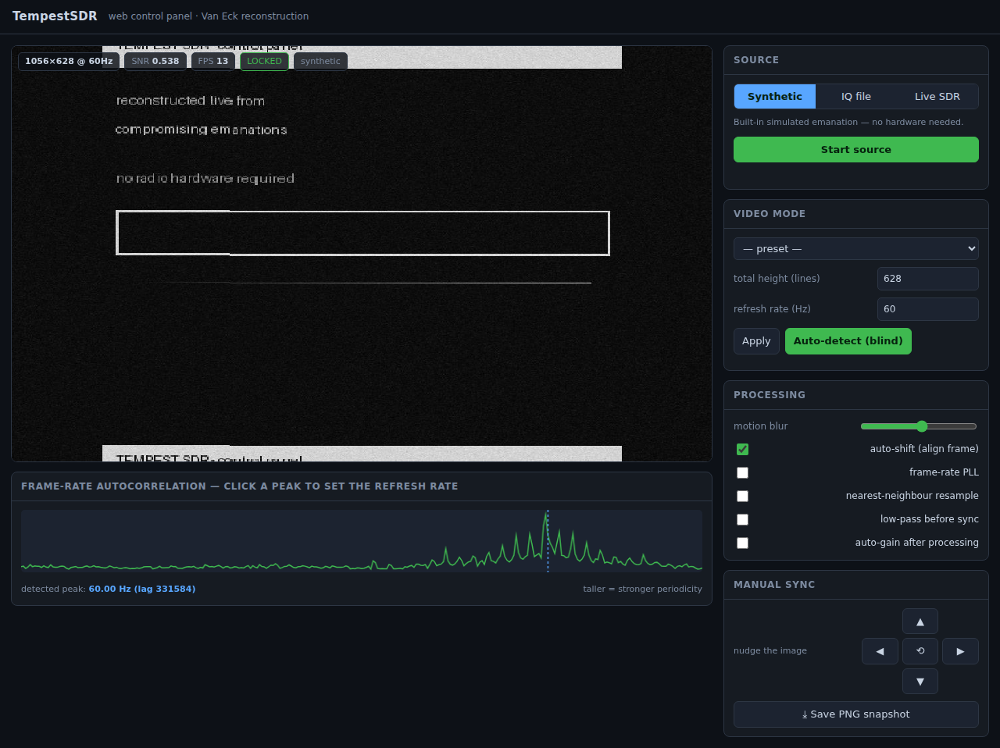

# TempestSDR — Python port

A software toolkit for **reconstructing the image on a video display from its
unintended electromagnetic emanations**, captured with a software-defined radio
(SDR). Raster video is sent one line of pixels at a time as a varying voltage;
that varying current radiates, and an SDR tuned nearby can pick it up. This
toolkit maps received field strength back to pixel shades to form a false-colour
estimate of what is on the screen — the classic *Van Eck phreaking* / **TEMPEST**
side channel.

This is a from-scratch **Python re-implementation** of Martin Marinov's
[TempestSDR](https://github.com/martinmarinov/TempestSDR) (originally a C library
with a Java GUI and native SDR plugins). It keeps the same algorithms and the
same GPLv3 licence, but replaces the C/Java/JNI stack with a single NumPy/SciPy
package that is easy to read, test and extend.

> **Blind operation.** As in the original, you do **not** need to know the
> target's resolution or refresh rate in advance — the toolkit estimates them
> from the signal by FFT autocorrelation.

### Example

The picture on the left is the "target" screen; the picture on the right is what
the pipeline reconstructs from a **simulated** emanation (no hardware), after
estimating the video mode blind. Produced by `python examples/demo.py`.

| Target screen | Reconstructed from emanations |
| --- | --- |
|  |  |

The characteristic horizontal "ghosting" is authentic — it comes from the
receiver's pixel clock not exactly matching the target's, exactly as seen in
real Van Eck reconstructions.

---

## ⚠️ Responsible use

This is a **security-research and educational** tool. TEMPEST emanations are a
real, well-documented side channel, and understanding them is the basis for
defending against them (shielding, TEMPEST-rated equipment, zoning).

Only capture emanations from **displays you own or are explicitly authorised to
test**. Intercepting the emanations of other people's equipment may be illegal
in your jurisdiction and is unethical. Radio reception is also regulated — know
your local rules. The authors provide this for legitimate research, teaching and
defensive evaluation only, and take no responsibility for misuse.

The included **synthetic generator** lets you run, learn and test the entire
pipeline **with no radio hardware and no real target at all** — start there.

---

## Install

```bash
pip install -e .              # core (numpy, scipy)
pip install pillow            # image I/O and PNG/GIF output (recommended)
pip install matplotlib        # optional real-time GUI viewer
pip install pyrtlsdr          # optional live RTL-SDR capture
# SoapySDR (system package)   # optional live capture for many other SDRs
```

Python 3.9+.

## Quick start — no hardware needed

```bash
# Run the whole pipeline against a synthetic capture and write two PNGs:
python examples/demo.py

# Or drive it from the command line: image -> synthetic emanation -> reconstruction
tempestsdr demo my_screen.png reconstructed.png \
    --mode "800x600 @ 60Hz" --samplerate 19895040 --snr 12 --motion-blur 0.6
```

`reconstructed.png` shows the picture recovered purely from the simulated radio
signal.

## Command-line interface

```
tempestsdr list-modes                    # list the VESA video-mode presets
tempestsdr synth   IMG  OUT.iq   ...     # forward-model a capture from an image
tempestsdr detect  CAP.iq        ...     # estimate refresh rate / line count (blind)
tempestsdr reconstruct CAP.iq OUT.png .. # reconstruct image(s) from a raw capture
tempestsdr demo    IMG  OUT.png  ...     # synth + reconstruct in one step
tempestsdr webgui                        # full browser control panel
tempestsdr live    ...                   # real-time from RTL-SDR / SoapySDR
```

Every capture file is raw interleaved I/Q. Supported sample formats match the
original `RawFile` plugin: `float`, `int8`, `uint8` (the `rtl_sdr` default),
`int16`, `uint16`. Run `tempestsdr <command> -h` for all options.

### Blind parameter estimation

```bash
tempestsdr detect capture.iq --samplerate 19895040 --format uint8
# refresh rate     : 60.000 Hz
# line period      : 528.00 samples
# estimated lines  : 628.0
# closest preset   : 800x600 @ 60Hz
```

## Web control panel

A full browser-based control panel — richer than the original Java GUI — runs
the reconstruction live and exposes every knob:

```bash
pip install flask pillow
tempestsdr webgui            # then open http://127.0.0.1:8000
```



It streams the recovered image live (MJPEG) and provides:

- **three sources** — a built-in synthetic emanation (works with no hardware),
  an uploaded raw-IQ capture, or a live RTL-SDR / SoapySDR front-end;
- **blind auto-detect** — one click estimates the refresh rate and line count
  from the signal and applies the matching geometry;
- a **clickable frame-rate autocorrelation plot** — click a peak to lock the
  refresh rate by eye;
- every processing knob live — motion-blur (frame averaging), auto-shift,
  frame-rate PLL, nearest-neighbour resampling, low-pass-before-sync,
  auto-gain placement — plus manual sync nudges and a PNG snapshot button;
- live **SNR, FPS, lock-state and geometry** read-outs.

## Library usage

```python
from tempestsdr import TempestProcessor, ProcessorConfig
from tempestsdr.sources import FileSource

src = FileSource("capture.iq", samplerate=19_895_040, sample_format="uint8")
proc = TempestProcessor(ProcessorConfig(
    samplerate=src.samplerate,
    height=628,          # total lines incl. blanking (e.g. 800x600@60 -> 628)
    refresh_rate=60.0,
    motion_blur=0.6,     # frame averaging pulls a weak signal out of the noise
))

frames = []
for block in src:
    frames.extend(proc.process(block))
# frames[-1] is a float32 array in [0, 1], shape (height, width)
```

Live capture:

```python
from tempestsdr.sources.rtlsdr_source import RtlSdrSource
from tempestsdr.gui import run_live_gui

src = RtlSdrSource(samplerate=8e6, center_freq=400e6, gain="auto")
proc = TempestProcessor(ProcessorConfig(samplerate=8e6, height=628, refresh_rate=60))
run_live_gui(proc, src)          # matplotlib live viewer
```

## How it works

The signal path (`tempestsdr/processor.py`) mirrors the original C library:

1. **AM demodulation** — the video envelope is the magnitude `|I + jQ|` of the
   complex baseband samples (`dsp.am_demodulate`).
2. **Frame-rate / line-rate detection** — FFT autocorrelation
   (`R = IFFT(|FFT(x)|²)`, Wiener–Khinchin) exposes the vertical refresh period
   and horizontal line period as peaks; the resolution is read off blind
   (`framerate.py`).
3. **Resampling** — the envelope is box-resampled to the pixel clock so each
   scan line maps to a row of pixels (`dsp.Resampler`). The streaming resampler
   is verified bit-for-bit against a whole-buffer reference and against a literal
   port of the C algorithm.
4. **Sync detection** — the frame is collapsed onto its horizontal and vertical
   axes; the blanking bars show up as a low-energy strip whose position (the
   "sweet spot") gives the sync offset. The frame is circularly shifted to align
   it, and the offset velocity can drive a refresh-rate PLL (`sync.py`).
5. **Auto-gain + frame averaging** — the picture is stretched across the full
   dynamic range and averaged over successive frames to lift a weak signal out
   of the noise (`dsp.AutoGain`, `dsp.time_lowpass`).

### Mapping to the original project

| Original (C / Java) | Purpose | This port |
| --- | --- | --- |
| `am_demod` (TSDRLibrary.c) | envelope detection | `dsp.am_demodulate` |
| `dsp_resample_process` (dsp.c) | resample to pixel clock | `dsp.Resampler`, `dsp.resample_box` |
| `fft_autocorrelation`, `frameratedetector.c` | blind rate estimation | `framerate.py` |
| `syncdetector.c`, `gaussian.c` | blanking / sync / PLL | `sync.py`, `dsp.gaussian_blur` |
| `dsp_autogain_run`, `dsp_timelowpass_run` | contrast + averaging | `dsp.AutoGain`, `dsp.time_lowpass` |
| `TSDRLibrary.c` (thread pipeline) | orchestration | `processor.py` |
| `TSDRPlugin_RawFile`, UHD/RTL/... | IQ sources | `sources/` |
| `VideoMode.java` | VESA presets | `videomodes.py` |
| `JavaGUI` (Swing control panel) | interactive front-end | `webgui.py` (browser), `gui.py` (matplotlib) |
| (new) | hardware-free testing | `synth.py` |

## Testing

```bash
pip install pytest pillow
pytest
```

The suite covers the DSP primitives (including faithfulness to the C reference),
blind rate detection, sync/blanking detection, the file formats, and full
image → synthetic capture → image reconstruction across a range of SNRs.

## Credits & licence

- Original **TempestSDR** © Martin Marinov — the algorithms, video-mode table
  and overall design come from that project.
- Related reading: Wim van Eck, *"Electromagnetic radiation from video display
  units: An eavesdropping risk?"* (1985); Markus Kuhn, *"Compromising emanations"*
  (2003).

Licensed under the **GNU General Public License v3.0** (see `LICENSE`), the same
licence as the original project.
